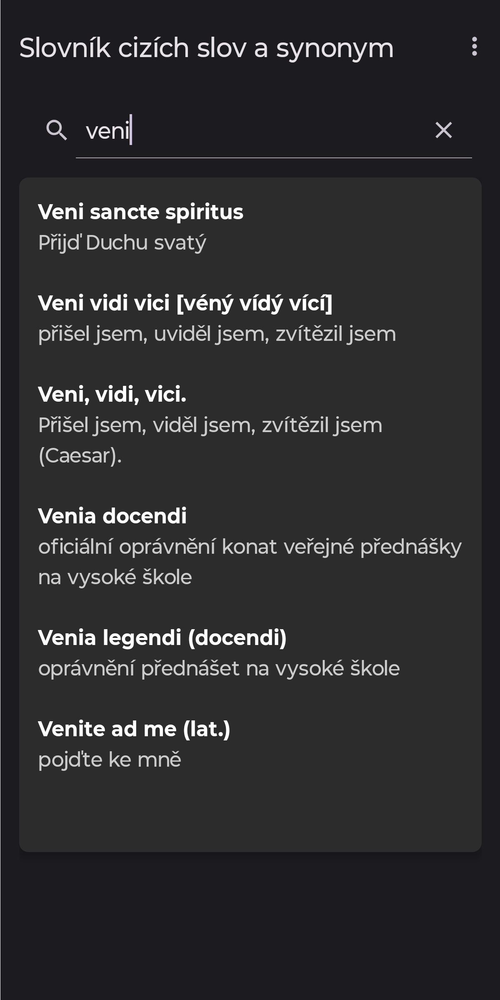

# Slovník cizích slov a synonym 📖

Offline Android aplikace pro vyhledávání českých synonym a cizích slov.

Aplikace vznikla z důvodu absence něčeho podobného. Data pochází čistě z ABZ [slovníku českých synonym](https://www.slovnik-synonym.cz/) a [slovníku cizích slov](https://slovnik-cizich-slov.abz.cz/) k datu 5. března 2026 a byla scrapována (nejedná se o oficiální aplikaci).

## Funkce
- Výsledky se zobrazují dynamicky okamžitě během psaní.
- Aplikace hledá jak synonyma pro česká slova, tak i překlady/definice slov cizího původu.
- Data jsou integrovaná přímo v aplikaci v `.json` formátu, není nutné připojení k internetu.
- Pokaždé, když vymažete vyhledávací pole, aplikace vám pro rozšíření obzorů nabídne nové náhodné slovíčko.

## Snímky obrazovky

| Náhodné slovo | Hledání konkrétního slova | Více výsledků pro dané slovo |
| ------------| --- | ---- |
|  |  |  |

## Instalace a spuštění

Instalace `.apk` android souboru:

1. Přejděte do sekce **[Releases](https://github.com/tucnakomet1/Slovnik-cizich-slov-a-synonym/releases)** v tomto repozitáři.
2. V nejnovější verzi si stáhněte soubor **`.apk`** (např. `Slovnik-v1.0.apk`).
3. Otevřete stažený soubor a zvolte *Instalovat*. 
   *(Poznámka: Telefon vás možná požádá o povolení instalace z neznámých zdrojů, jelikož aplikace není stažena z Google Play).*